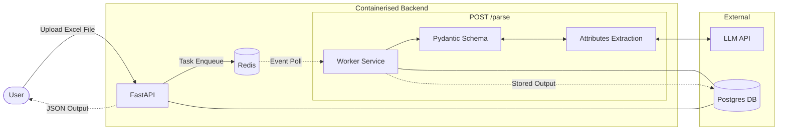

# 📊 Excel Document Parser

**FastAPI service** that transforms inconsistent Excel product schedules into standardized, type-safe JSON. This parser uses a hybrid architecture that combines deterministic heuristics with data extraction using LLM.

The current pipeline includes the following steps:

- **Ingestion**: Reads and converts raw XLXS file into dataframe.
- **Detection**: Heuristic-based header discovery using data density analysis.
- **Mapping**: Header matching using two-pass matching (Exact -> Substring) with LLM extraction as fallback.
- **Consolidation**: Multi-row records are merged using `doc_code` as primary key.
- **Enrichment**: Attribution extraction via LLM tool calls (e.g. Google Gemini).
- **Normalization**: Units (m -> mm), currency, and quantity cleanup.

### System Architecture

For production-grade workloads, we can design the system to transition to an asynchronous, task-based workflow.

Note: This is a simple example and does not include all the features of a production-grade system.



## 🚀 Quick Start

### Prerequisites

- Python 3.13+
- Google Gemini API key

### 1. Install `uv` (Package Manager)

**macOS/Linux:**

```bash
curl -LsSf https://astral.sh/uv/install.sh | sh
```

**Windows:**

```powershell
powershell -c "irm https://astral.sh/uv/install.ps1 | iex"
```

### 2. Installation

```bash
# Clone the repository
git clone https://github.com/alberttjc/excel-parser.git
cd programa

# Sync dependencies and create virtual environment
uv sync --extra dev

# Configure API key
cp .env.example .env
# Edit .env and add your GEMINI_API_KEY
```

### 3. Running the Server

```bash
# Start the service
uv run main.py

```

_The API is now live at `http://localhost:8000`. Access the Web UI at `http://localhost:8000/` to upload files._

---

## 📡 API Usage

### Parse Excel File

**Endpoint:** `POST /parse`

**Sample Request:**

```bash
curl -X POST "http://localhost:8000/parse" \
  -H "Content-Type: multipart/form-data" \
  -F "file=@your_schedule.xlsx"
```

**Sample Response:**

```json
[
  {
    "schedule_name": "Sheet1",
    "products": [
      {
        "doc_code": "F64",
        "product_name": "Study Chair",
        "brand": "Example Brand",
        "colour": "BLACK",
        "finish": "MATT",
        "material": "METAL",
        "width": 600,
        "length": 600,
        "height": 800,
        "qty": 4,
        "rrp": 299.99,
        "feature_image": null,
        "product_description": "A modern study chair",
        "product_details": "Warranty: 5 years"
      }
    ]
  }
]
```

---

## 📚 Endpoints

| Method | Path      | Description                                        |
| ------ | --------- | -------------------------------------------------- |
| GET    | `/`       | HTML upload interface                              |
| GET    | `/health` | Health check                                       |
| POST   | `/parse`  | Parse Excel file (returns `List[ProductSchedule]`) |

---

## 🧪 Testing

```bash
# Run all tests
uv run --with pytest --with pytest-cov pytest tests/ -v

# Run with coverage report
uv run --with pytest --with pytest-cov pytest tests/ --cov=app --cov-report=html
```

Tests include:

- **API Tests**: Endpoint validation, file upload handling
- **Model Tests**: Pydantic model validation
- **Parser Tests**: Header detection, data cleaning, normalization

---

## 🐳 Docker Workflow

For production or containerized environments:

| Action    | Command                                   |
| --------- | ----------------------------------------- |
| **Build** | `docker build -t programa .`              |
| **Run**   | `docker run -p 8000:8000 programa`        |
| **Test**  | `curl http://localhost:8000`              |
| **Clean** | `docker stop <id> && docker rmi programa` |
